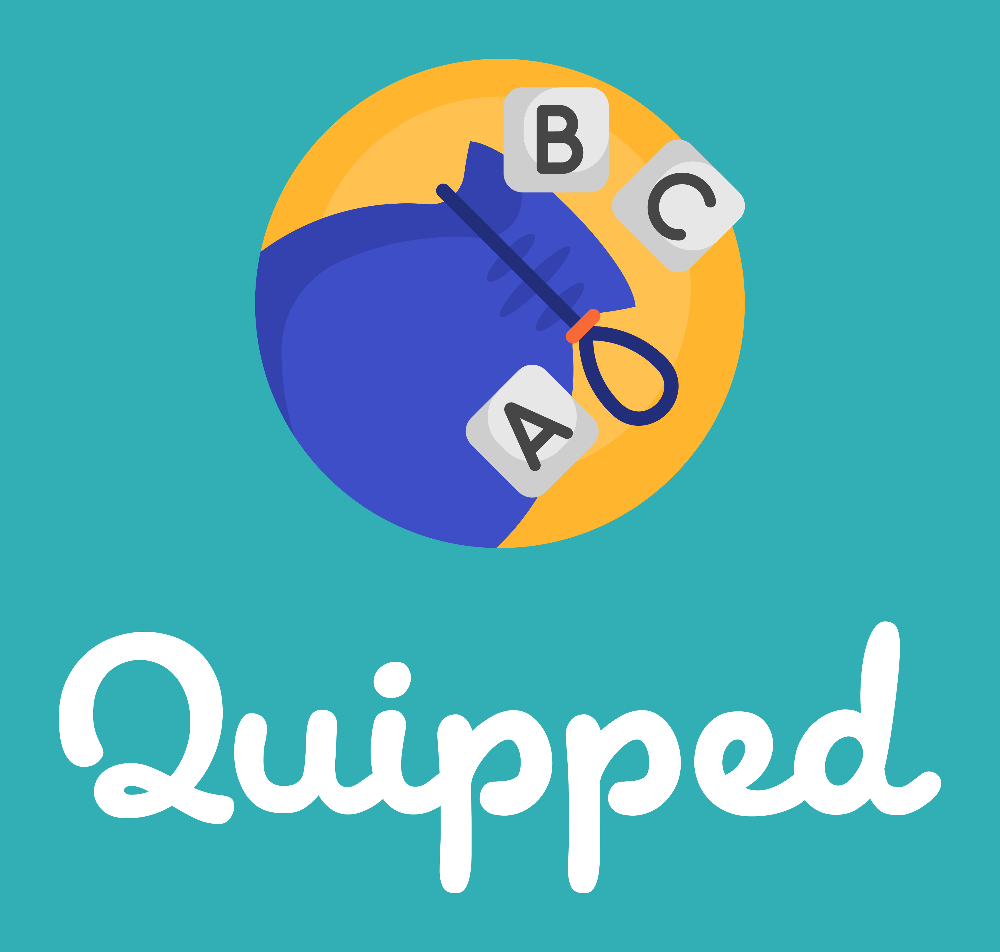

# Quipped




Every day Quipped challenges you and your friends to produce a word with the highest score from today's puzzle! As a Python and Azure powered progressive web app you can play from anywhere!

Use Python 3.11 to get started. You can install all dependencies from requirements.txt You can then run Gunicorn (Quipped's web server of choice) to test/play Quipped:

```
python -m pip install -r requirements.txt
gunicorn --bind=0.0.0.0 --timeout 600 "app:create_app()"
```

You can play Quipped live [here!](https://quipped.app)

Check out the .github/workflows/main_quip.yml file to see how you can deploy this app for yourself using Microsoft's Azure App Service!
